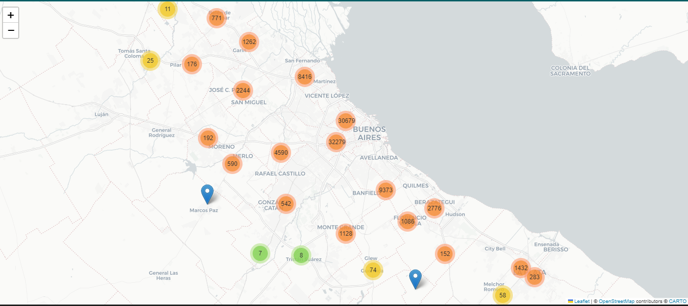
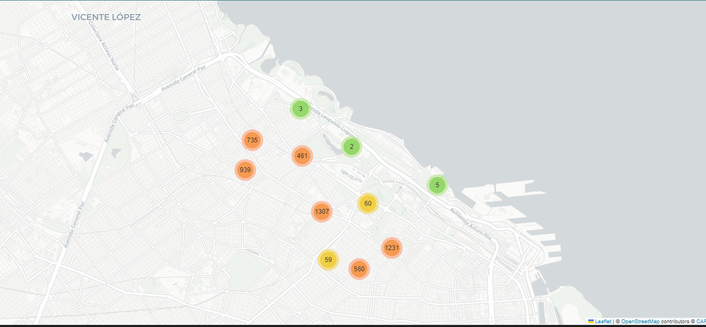
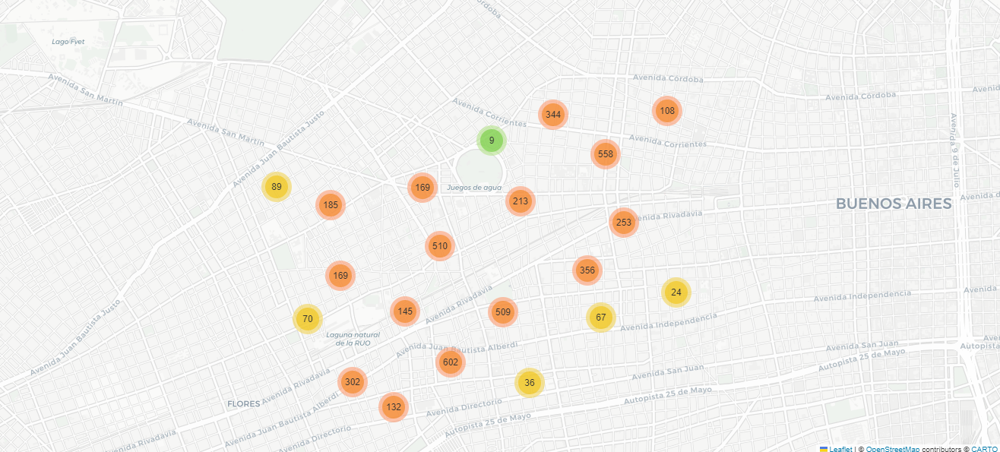
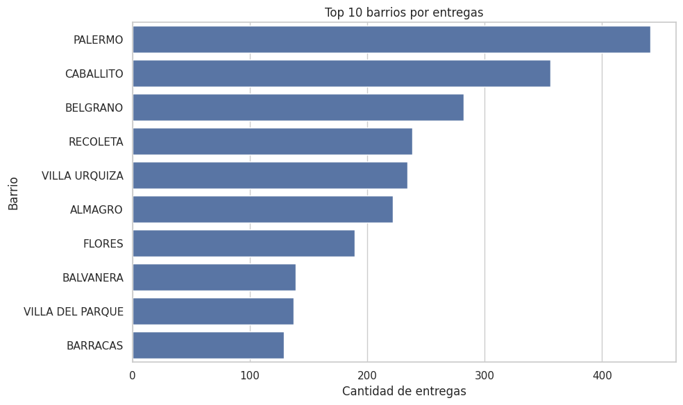
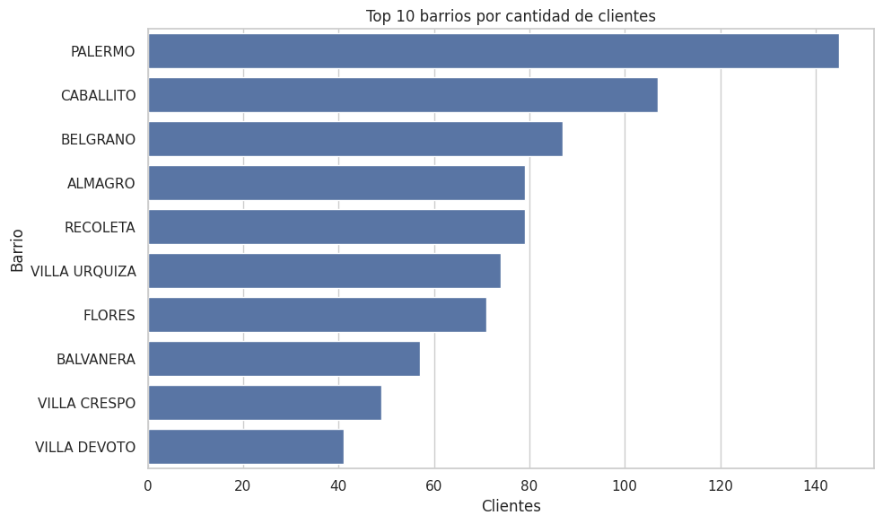

# 📦 Análisis de Entregas Logísticas – Optimización de última milla

Este proyecto surge a partir de datos reales de entregas domiciliarias con los que trabajé en una operación logística.

La idea fue entender cómo se comportan los clientes, dónde se concentran las entregas y qué oportunidades hay para mejorar la distribución o incluso armar algo propio a partir de esto.

---

## 🎯 Objetivo

Más que hacer un análisis técnico, el foco fue responder preguntas concretas:

- ¿Dónde están realmente los clientes?  
- ¿Se pueden agrupar para optimizar rutas?  
- ¿Hay zonas que justifican un esquema de reparto propio?  
- ¿Se puede pensar en un modelo tipo suscripción o marketplace?  

---

## 📊 Dataset

Se trabajó con un dataset anonimizado de entregas reales:

- +25.000 registros  
- ~90.000 clientes únicos  
- Ubicación: AMBA (principalmente CABA)  

Incluye información como:

- Dirección  
- Latitud / Longitud  
- Cliente  
- Zona  

---

## 🧠 Qué hice

- Limpieza y normalización de datos  
- Eliminación de duplicados  
- Georreferenciación de clientes  
- Segmentación por zonas  
- Visualización en mapas para entender la distribución real  

---

## 📍 Visualización geográfica

### 🌎 Mapa general de clientes

### 📌 Zona Palermo - Belgrano

### 📌 Zona Caballito - Almagro

---
## 📊 Análisis de distribución

### 📌 Barrios con mayor volumen de entregas

Se observa una fuerte concentración de entregas en determinados barrios, lo que permite identificar zonas estratégicas para optimizar rutas y mejorar la eficiencia operativa.

---

### 👥 Barrios con mayor cantidad de clientes

Este patrón acompaña la distribución de entregas, lo que refuerza la idea de concentración de demanda en zonas específicas.
## 💡 Qué encontré

- Hay zonas con alta concentración de entregas  
- Se forman clusters claros que permiten pensar rutas más eficientes  
- Hay clientes recurrentes con potencial comercial  
- La distribución no es uniforme, lo que abre oportunidades para segmentar  

---

## 📈 Impacto potencial

A partir de este análisis, se pueden tomar decisiones concretas como:

- Redefinir zonas de reparto  
- Mejorar la eficiencia de rutas  
- Detectar oportunidades comerciales en clientes recurrentes  
- Evaluar modelos de distribución más escalables  

---

## 🚀 Para qué sirve esto

Este análisis no queda solo en lo descriptivo.

Se puede usar como base para:

- Optimizar una operación logística existente  
- Definir zonas de reparto  
- Armar un esquema de entregas por suscripción  
- Pensar un marketplace de delivery (por ejemplo, enfocado en bebidas u otros productos de consumo recurrente)  

---

## 🛠️ Tecnologías utilizadas

- Python  
- Pandas  
- Folium  
- Geopandas  
- Jupyter Notebook  

---

## 🧩 Contexto

Este análisis parte de datos reales de una operación logística en la que participé, lo que permitió no solo trabajar con información concreta, sino también entender cómo se traduce en decisiones operativas.

Más allá del análisis descriptivo, el enfoque estuvo puesto en identificar patrones que puedan convertirse en mejoras reales de la operación o incluso en oportunidades de desarrollo de nuevos modelos de distribución.
